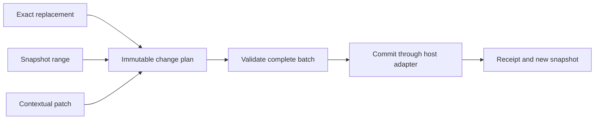

I’d build ULTRA as **an edit compiler built around immutable snapshots**. It would turn the model’s request into an exact, inspectable change plan, validate the complete plan, commit that specific result, and return a receipt describing what happened.

Building on [the research report](agent-edit-tools-research.md), I’d put most of the engineering into targeting, batch semantics, preservation, and recovery. Those determine whether a convenient editing interface is also dependable.

**One execution engine would serve every editing format.** Exact replacements, range references, and contextual patches would compile into the same internal representation:

```text
FilePlan {
    base_snapshot
    replacements: [
        { start_byte, end_byte, replacement_bytes }
    ]
    preconditions
    provenance
}
```

The executor would operate on original byte ranges and literal replacement bytes. It would never call a model.



That separation lets us improve how models express edits without repeatedly implementing matching, filesystem writes, undo, or conflict handling.

**Read and search would be part of the editing protocol.** They would return source text together with short references:

```text
src/retry.ts — snapshot s17

r4   12 | const retries = 2;
r5   47 | const delayMs = 100;
```

Internally, `s17` would identify the workspace, target file or document, exact original bytes, encoding, and displayed ranges. `r4` would identify a precise span within that snapshot. The model copies references; the host maintains the full identities and digests.

A normal edit could then look like:

```json
{
  "request_id": "edit-42",
  "files": [{
    "base": "s17",
    "changes": [
      {
        "id": "change-1",
        "op": "replace",
        "target": { "span": "r4" },
        "text": "const retries = 3;"
      },
      {
        "id": "change-2",
        "op": "replace",
        "target": { "span": "r5" },
        "text": "const delayMs = 250;"
      }
    ]
  }]
}
```

This avoids retranscribing the old code. Exact old/new replacements would remain available, including searches scoped to a returned function or region. Patch syntax would be another adapter. I would benchmark which interface to expose to each model; one enormous schema containing every possible editing method would add unnecessary decision overhead.

References establish *which content* an edit addresses. They cannot establish that the model chose the correct function or understood the task.

**MultiEdit would be the core operation.** A single edit would simply contain one change. The default contract would be:

| Question | ULTRA’s rule |
|---|---|
| What does each change search? | The same original snapshot for that file. |
| Can a later change target newly inserted text? | No; express the final replacement directly. |
| What if one target is missing or ambiguous? | Reject the complete plan before changing any target file. |
| What if replacement spans overlap? | Reject and identify the conflicting changes. |
| Can locating context overlap? | Yes; context is distinct from bytes being replaced. |
| What about competing insertions at one position? | Require the caller to combine them. |
| Does array order affect independent changes? | No. |
| How does replace-all work? | Explicit scope and expected count; overlapping matches require disambiguation. |

I would count overlapping candidate occurrences during ambiguity detection. Searching for `aa` in `aaa` must expose both possible starting positions.

Expected counts would be prominent in the interface: one for an ordinary exact replacement, and an explicit count for a scoped replace-all. A correct count is a necessary check, but does not establish that the intended occurrence was selected; snapshot and target identity still apply.

Sequential editing could be added as an explicit adapter if a real integration needed it. That adapter would simulate every intermediate state and validate against that state before producing its final output.

**Preparation would produce the exact output that gets committed.** The execution path would be:

1. Validate the request and resolve its snapshot references.
2. Find every target and check cardinality, boundaries, and conflicts.
3. Construct each resulting file once from original slices and replacement bytes.
4. Run any explicitly requested formatting or preparatory checks against that candidate.
5. Acquire coordination for the affected targets and revalidate their bases.
6. Persist the prepared output and record the outcome.

Commit would never rematch an old request against newly changed content. If the base changed, the prepared plan becomes stale.

Preparation would collect all safely discoverable per-change failures in one response, so the caller can correct several errors together.

Internally, preparation and commitment would be separate. The ordinary `edit` call would perform both in one round trip. A preview option could return an immutable plan reference for review, with commitment still conditional on its original bases.

**Byte preservation would be an invariant.** The reconstruction rule would be:

```text
original prefix
+ replacement bytes
+ original middle
+ replacement bytes
+ original suffix
```

Everything outside the declared replacement spans would remain identical. That includes mixed line endings, tabs, Unicode forms, Markdown trailing spaces, and the absence of a final newline.

If the display uses LF while storage uses CRLF, the read layer would retain a mapping back to original byte positions. Newly inserted line endings would follow a documented policy. Unsupported encodings would produce an explicit error.

Formatting would be a separately attributed transformation. It could run once on the completed candidate, with its changes included in the final diff and undo state.

**Recovery would make exact editing inexpensive.** When matching fails, ULTRA would return a small set of useful candidates:

```text
TARGET_NOT_FOUND — no target files changed

Closest candidate: r31, snapshot s18
Actual:    request.role !== "admin"
Requested: request.role === "admin"
Difference: operator differs

Candidate is available for inspection and explicit selection.
```

Recovery could use indentation analysis, Unicode comparisons, token similarity, or syntax structure. Its output would include exact current text and valid references.

The model could then select a candidate and submit an exact edit. This keeps recovery flexible while making the final mutation explicit. An apply model could eventually propose a plan through the same route, with its generated changes fully attributable.

**Repair would reuse unchanged requests without retransmitting them.** Every change would have an ID unique within its request. A planning failure would return a draft reference retaining the request, original snapshots, and diagnostics. The caller could replace a failed change by ID; correcting one of eight edits would require sending only that correction.

Repair would also be available for an uncommitted preview. It would preserve unchanged edits and their positions, then recompile and validate the complete batch against the original snapshots under a new request ID. The result would be a new immutable plan. A sequential adapter would re-evaluate every intermediate state in its original order. Stale bases would require fresh reads and a new plan; expired references would fail explicitly and could never resolve to an unrelated draft after a restart.

This repair path would end when target mutation begins. A partial commit would require inspecting the receipt and preparing a fresh request for confirmed outstanding work. An uncertain outcome would require reconciliation before another mutation. Applying an unchanged preview would commit its recorded candidate, subject to its base checks.

**The storage adapter would define the concurrency guarantees.** I would provide separate implementations for ordinary files and editor documents.

For an editor integration, reads and commits would use the document buffer and version checks. For filesystem use, a coordinator would serialize cooperating mutations, acquire multiple target locks in a stable order, and check the original content immediately before persistence.

The adapter would resolve supported path aliases to one target identity before preparation and locking, rejecting unresolved identity conflicts. Different path spellings must not cause the same target to be prepared and overwritten as separate files.

Strict stale-snapshot rejection would be the initial policy. A future rebase feature could map an old plan onto new content and return a fresh plan for acceptance.

The persistence contract needs three distinct guarantees:

- **Complete preflight:** every requested change validates before target mutation begins.
- **Single-file visibility:** use atomic replacement where the supported backend supplies it.
- **Multi-file outcomes:** report exactly which files committed when a later operation fails.

A persistence failure would stop subsequent writes. Each target would be reported as committed, not committed, or outcome unknown, with the failure or non-attempt reason. The aggregate status and applied counts would derive from persistence outcomes, separately from the number of changes that validated.

A journal helps recovery; it does not make several ordinary file replacements one atomic transaction. Likewise, a hash check followed by replacement does not exclude arbitrary external writers.

Platform adapters would interpret actual failure effects. Windows `ReplaceFile`, for example, documents error states in which filenames or metadata have already changed. An error cannot universally mean “nothing happened.” [Microsoft’s API contract](https://learn.microsoft.com/en-us/windows/win32/api/winbase/nf-winbase-replacefilew)

**Receipts would be part of the protocol from day one.** A result would distinguish mutation from validation:

```json
{
  "request_id": "edit-42",
  "commit": "committed",
  "files": [{
    "before": "s17",
    "after": "s18",
    "changes_applied": 2
  }],
  "formatting": "not_requested",
  "validation": "failed",
  "diff": "d9",
  "undo": "u6"
}
```

Here, failed validation means the edit committed and the checks failed. Retrying the mutation would be the wrong recovery action.

The host would persist request identity, immutable plan identity, commit intent, and receipts. Repeating a completed request ID would return its original receipt; supplying different arguments under that ID would fail.

A crash can leave insufficient evidence to establish whether a write happened. That state would be `outcome_unknown`, and automatic replay would stop. Current bytes alone cannot always reconstruct historical execution when other writers are involved.

Undo would also be conditional: restore the recorded before-state only if the current state still equals the recorded after-state.

**Reports would be compact, with complete evidence available by reference.** The default would show separate changed regions, elide long excerpts, and fall back to summaries when output exceeds a budget. Explicit diff and summary modes would let the host adapt to its own source-change notifications. Budgets would cover both lines and characters, including a very long single line.

Every mode would retain the commit status and identify failures. The complete receipt would preserve per-file outcomes, per-change diagnostics, expected and actual counts, and a full before/after diff including deletions. Details exceeding the inline budget would remain retrievable by reference. Elided source would not be treated as observed in the read protocol.

Command execution, timeouts, and background checks would remain host responsibilities. The host could orchestrate edit-then-check workflows while reporting mutation and validation separately.

**I’d implement a compact core first, then extend it using evidence.** For a standalone product, I’d choose a Rust library with thin host adapters. A local service would become useful when several agent processes need shared coordination.

The first release would include exact and range targeting, single- and multi-file batches with complete preflight and truthful commit outcomes, byte preservation, stale detection, actionable failures, previews, repair by change ID, compact reports, receipts, and conditional undo. Basic file creation, deletion, and renaming would have distinct operations and explicit destination preconditions.

I’d add contextual patches for models that benefit from them and language-server refactoring for semantic operations such as symbol rename. Regex would be an adapter candidate if benchmarks justify it, resolving scoped matches and expanded replacement text into exact plans with explicit counts, validated options, and bounded matching work. Automatic rebasing and model-based application would follow demonstrated need.

**The release gate would test guarantees before measuring convenience.** The most valuable properties would be:

- Rejection during planning leaves every target unchanged.
- Bytes outside declared transformations remain identical.
- Independent edits commute and do not influence one another’s reconstruction.
- Every committed output equals its prepared output.
- Applying a preview rejects a stale base even when the matcher would still succeed elsewhere.
- Repair preserves retained edits, revalidates conflicts across the complete batch, and uses a new request identity.
- Retries preserve recorded outcomes.
- Path aliases cannot produce competing candidates for one target.
- Conditional undo cannot overwrite newer work.
- Fault injection produces accurate partial or uncertain receipts.
- Report budgets bound long lines and distant changes while preserving access to complete outcomes and diffs.

Separately, I’d compare interfaces using real model-driven tasks: correct target selection, correct final changes, unintended modifications, recovery cost, tokens, and latency. Measure the complete workflow, including correction payloads, repeated reads, result volume, host synchronization, and approval interruptions. Check whether models actually use repair references and compact reporting when available, and test supported hosts separately.

[Super Edit v0.2.0 at commit d9aefdd](https://github.com/danya02/claude-code-extras/tree/d9aefddf90c24cb4548251a9d0bf52f467bc3dc8/plugins/super-edit) would be an initial batch-editing baseline alongside the tools in the research report. Its [field observations](https://github.com/danya02/claude-code-extras/blob/d9aefddf90c24cb4548251a9d0bf52f467bc3dc8/plugins/super-edit/NOTES.md) motivate the reporting, repair, and integration cases; comparative reliability and cost claims would require our own measurements.

The distinctive benefit I’d aim for is **a cheap path from imperfect model intent to a precise, verifiable edit**—with every committed byte, conflict, and retry accounted for.
